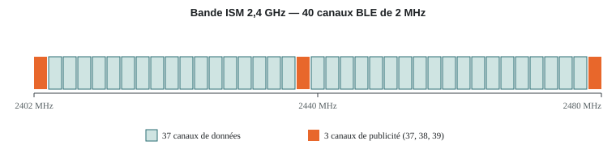
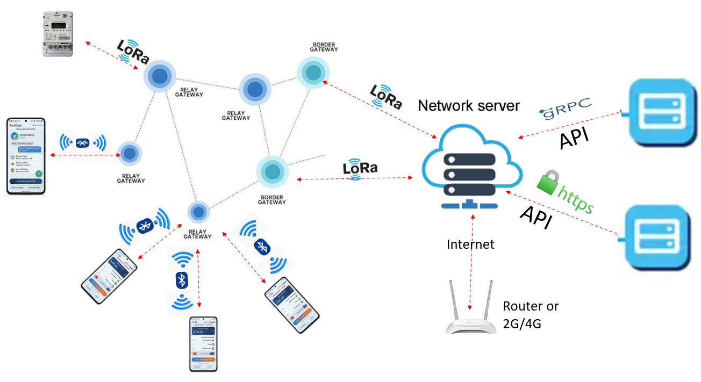

# Bluetooth Low Energy (BLE)

## Qu'est-ce que le BLE ?

Le **Bluetooth Low Energy** est la variante basse consommation du Bluetooth, introduite dans la norme **Bluetooth 4.0** et affinée depuis (BLE 5.x). Il a été conçu dès l'origine pour des objets alimentés par pile pouvant fonctionner pendant des mois, voire des années, sans recharge — l'appareil reste endormi la majeure partie du temps et ne se réveille que pour émettre ou recevoir.

## Modulation et bande de fréquence

Le BLE module en **GFSK** (*Gaussian Frequency Shift Keying*) dans la bande ISM à **2,4 GHz** (2400–2483,5 MHz), découpée en **40 canaux de 2 MHz** : 3 canaux de publicité (*advertising*, canaux 37, 38, 39) et 37 canaux de données.

<figure markdown="span">
  
  <figcaption>Découpage de la bande ISM 2,4 GHz en 40 canaux BLE — les 3 canaux de publicité servent à la découverte des appareils avant toute connexion.</figcaption>
</figure>

## Débit et portée

- **Débit** : jusqu'à **1 Mbps** (BLE 4.x), **2 Mbps** avec le PHY « LE 2M » (BLE 5.0+). Le débit applicatif réel est plus faible une fois la charge de protocole déduite.
- **Débit longue portée** : le PHY « LE Coded » (BLE 5.0+) sacrifie du débit pour étendre la portée à plusieurs centaines de mètres.
- **Portée usuelle** : environ **10 à 100 m** selon la puissance d'émission, l'environnement et les obstacles.
- **Consommation** : très faible — c'est la raison d'être du BLE.

## Rôles et topologie

<figure markdown="span">
  
  <figcaption>Dans ce projet, le BLE assure la liaison « dernier mètre » entre le smartphone et le relais, avant que la donnée ne transite sur le maillage LoRa.</figcaption>
</figure>

- **Central** (ex. un smartphone) : initie les connexions vers un ou plusieurs Peripherals.
- **Peripheral** : annonce sa présence (*advertising*) et accepte une connexion d'un Central.
- **Broadcaster / Observer** : diffusion de données sans connexion établie (ex. balises).
- **GATT** (*Generic Attribute Profile*) : structure les données échangées une fois connecté, sous forme de *services* et de *caractéristiques* — c'est le vocabulaire que manipulent la plupart des applications BLE.

## Rôle dans ce projet

Le BLE est le lien entre le **smartphone** (qui l'intègre nativement, contrairement à LoRa ou au Wi-Fi HaLow) et le relais/dongle du projet. C'est par ce canal que l'utilisateur déclenche une transaction ou une lecture de télémétrie, avant que le relais ne bascule la donnée vers LoRaWAN ou Wi-Fi HaLow selon le service demandé. Voir la [comparaison complète](index.md).
