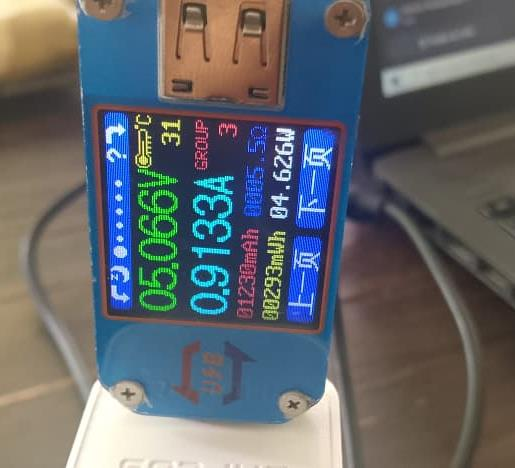
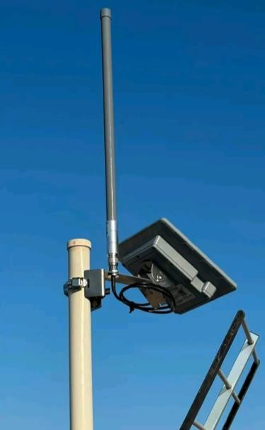
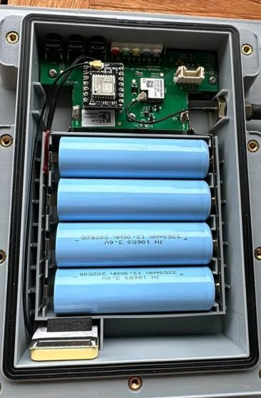

# Conception électronique

!!! info "Section en cours de complétion"
    Le dimensionnement de l'alimentation ci-dessous est finalisé. Le schéma bloc complet, le choix détaillé des composants et les schémas électriques/PCB seront ajoutés au fur et à mesure de l'avancement.

Ce qui doit encore y figurer :

- Schéma bloc de l'électronique (MCU, modules radio LoRa/BLE/HaLow, alimentation)
- Choix des composants et justification (voir le [budget](budget.md))
- Schémas électriques / routage PCB une fois disponibles
- Contraintes CEM et antennes

## Dimensionnement de l'alimentation

Le réseau repose sur deux types d'équipements qui doivent chacun rester alimentés en continu, sans dépendre du secteur électrique : les **stations relais** déployées sur le terrain, et le **Network Core** qui centralise les communications. Chacun a été dimensionné séparément — consommation réelle, puis capacité de batterie et de panneau solaire nécessaires pour tenir au moins 24 heures d'autonomie, y compris sans soleil.

### Stations relais (nœuds du réseau d'accès)

Chaque station relais est alimentée par un panneau solaire de **12 V / 30 W** associé à une batterie lithium-ion de **3,7 V / 12 000 mAh**, un système de gestion d'énergie assurant la régulation et la conversion vers les 5 V requis par la carte électronique. Le dimensionnement part d'une consommation continue mesurée de **200 mA sous 5 V**, soit une puissance de 1 W (P = U × I) et un besoin journalier de 24 Wh pour un fonctionnement continu sur 24 heures.

| Paramètre | Valeur retenue |
|---|---|
| Consommation continue | 200 mA sous 5 V |
| Puissance consommée | 1 W |
| Énergie nécessaire par jour | 24 Wh |
| Batterie | Li-ion 3,7 V / 12 000 mAh |
| Énergie nominale de la batterie | 44,4 Wh |
| Énergie utile estimée (rendement 90 %) | ≈ 40 Wh |
| Autonomie théorique sur batterie seule | ≈ 40 h |
| Panneau solaire | 12 V / 30 W |
| Production théorique (4 h d'ensoleillement efficace) | 120 Wh/jour |

Avec un rendement global de 90 % (pertes de conversion et de gestion de charge), la batterie offre une énergie utile d'environ 40 Wh, soit près de **40 heures d'autonomie sur batterie seule** — largement au-delà de l'objectif minimal de 24 heures, avec une réserve de 16 Wh. Côté production, le panneau de 30 W fournit environ **120 Wh par jour** (sur une base de 4 heures d'ensoleillement efficace), soit cinq fois le besoin quotidien de 24 Wh : une marge confortable pour absorber les pertes du système et recharger la batterie même par ensoleillement réduit.

### Network Core (cœur de réseau)

Le Network Core doit rester disponible en permanence, y compris pendant les périodes sans production solaire, puisqu'il gère et achemine les communications de l'ensemble des stations relais. Sa consommation réelle a été mesurée expérimentalement à l'aide d'un wattmètre USB **UM25C**, plutôt qu'estimée sur plaque signalétique.

<figure markdown="span">
  
  <figcaption>Mesure expérimentale de la consommation du Network Core au wattmètre UM25C : 5,07 V / 0,91 A.</figcaption>
</figure>

La mesure a donné environ **0,906 A sous 5 V**. Pour tenir compte des variations de charge et garder une marge de sécurité, le dimensionnement retient un courant de **1,5 A sous 5 V**, soit une puissance de 7,5 W et un besoin énergétique journalier de 180 Wh.

| Paramètre | Valeur retenue |
|---|---|
| Consommation mesurée | 0,906 A sous 5 V |
| Courant de dimensionnement (marge de sécurité) | 1,5 A sous 5 V |
| Puissance de dimensionnement | 7,5 W |
| Besoin énergétique journalier | 180 Wh/jour |
| Batterie | LiFePO₄ 12,8 V / 18 Ah |
| Énergie nominale de la batterie | 230,4 Wh |
| Énergie utile (90 %) | 207,36 Wh |
| Autonomie théorique | ≈ 27,6 h |
| Panneau photovoltaïque | 12 V / 100 W |
| Régulation | MPPT |
| Conversion finale | 12,8 V → 5 V (DC-DC abaisseur / buck) |
| Production théorique (4 h solaires équivalentes) | 400 Wh/jour |
| Production utile estimée (rendement 75 %) | ≈ 300 Wh/jour |
| Marge énergétique quotidienne | 120 Wh/jour |

La chaîne d'alimentation retenue est donc : **panneau photovoltaïque (12 V / 100 W) → régulateur MPPT → batterie LiFePO₄ (12,8 V / 18 Ah) → convertisseur DC-DC abaisseur → équipements 5 V du Network Core**. Avec une énergie utile de 207,36 Wh sur batterie, l'autonomie théorique atteint environ **27,6 heures**, au-delà de l'objectif d'une journée complète. Et malgré un rendement global plus conservateur de 75 % (température, câblage, régulateur, charge de la batterie), le panneau de 100 W produit environ 300 Wh par jour, largement au-dessus des 180 Wh nécessaires — une marge de 120 Wh/jour qui permet de recharger la batterie même après une nuit ou une période peu ensoleillée.

### Vue d'ensemble physique d'une station relais

**Le rendu final physique des stations relais qu'on compte obtenir :**

<figure markdown="span">
  
  <figcaption>Partie extérieure d'une station relais : antenne omnidirectionnelle et panneau solaire montés sur mât.</figcaption>
</figure>

<figure markdown="span">
  
  <figcaption>Intérieur du boîtier étanche : carte électronique (MCU + module radio) et pack de 4 batteries Li-ion 18650.</figcaption>
</figure>

!!! note "Source"
    Dimensionnement repris de la note technique interne « Conception et développement d'un réseau maillé de communication LPWAN » (J. Ahanninkpo, département R&D, 6 septembre 2026).

[📄 Télécharger la documentation technique complète (PDF)](assets/electronique/note-technique-lpwan.pdf){ .md-button .md-button--primary }
