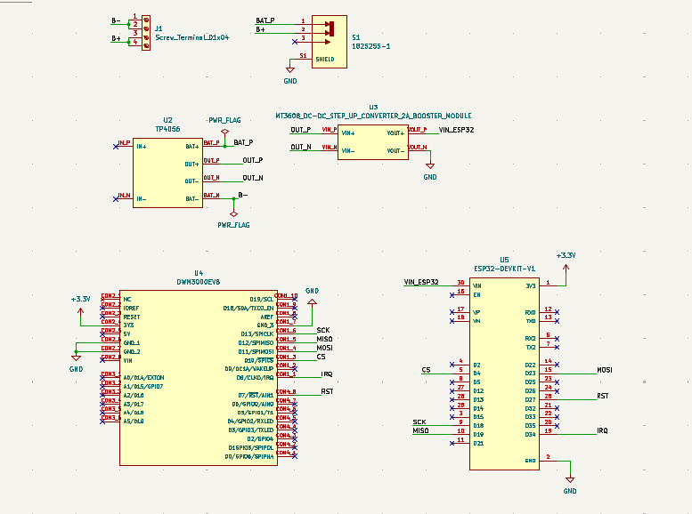
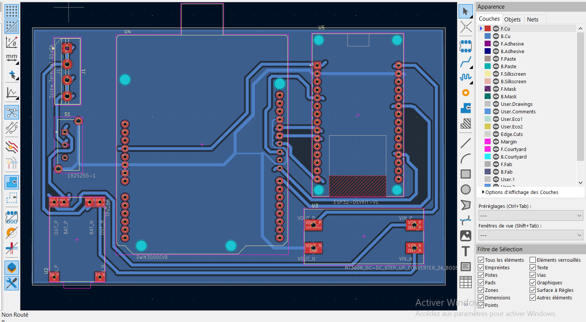
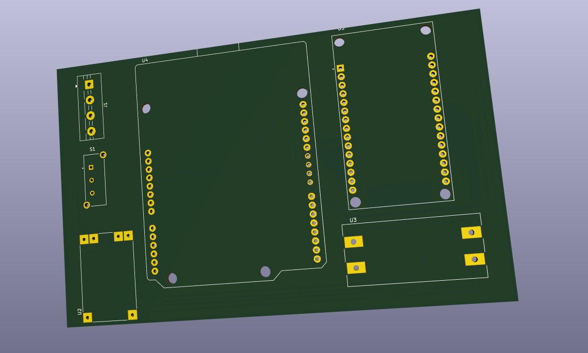
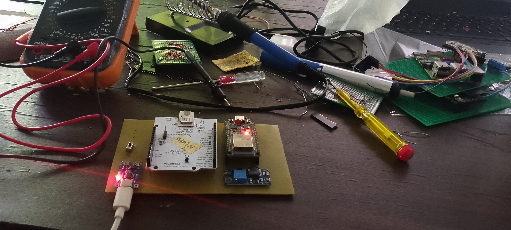
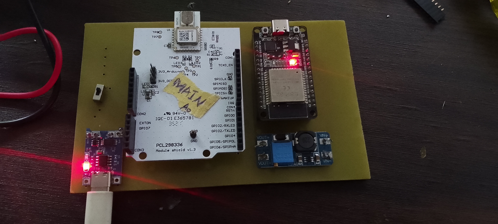
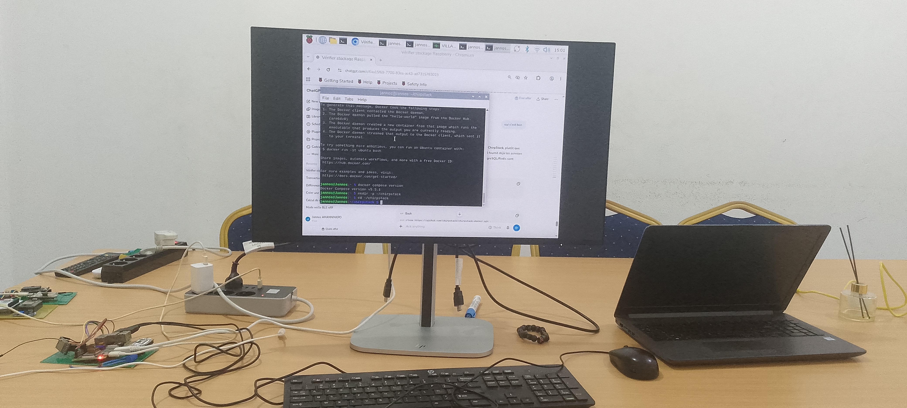

# Évolution du projet

Cette page retrace l'état d'avancement réel du projet et les tests effectués avec le matériel actuellement disponible en laboratoire, en attendant la commande des composants listés dans le [Budget](budget.md) pour un déploiement à grande échelle.

## Niveau actuel

🟡 **Phase de test en laboratoire.** L'étude technique (choix entre les Solutions 1, 2 et combinée, voir l'[Aperçu](index.md)) est terminée. Le projet est maintenant en phase de validation pratique avec le matériel de bord actuellement en notre possession, avant la commande du matériel nécessaire à un déploiement réel.

## Test en cours

**Objectif du test** : établir une liaison de communication entre les locaux de **FedaPay** et ceux de **Nautilus**, **sans passer par Internet**, en n'utilisant que le **Bluetooth (BLE)** et le **LoRa**.

Ce test vise à valider, en conditions réelles et à petite échelle, le principe même de la Solution 1 décrite dans l'Aperçu : le BLE pour relier les appareils au relais le plus proche, et le LoRa pour faire transiter les données de relais en relais jusqu'à destination — le tout sans aucune dépendance à un opérateur télécom ou à une connexion Internet.

!!! note "Portée du matériel actuel"
    Le matériel mobilisé pour ce test est celui déjà disponible en laboratoire ; il ne représente pas encore la configuration complète prévue pour un déploiement réel, ni la couverture visée à terme.

## Conception et prototypage — captures et photos

Schémas réalisés avec **KiCad 10**.

### Schéma électronique (KiCad)

### Routage PCB (KiCad)

### Vue 3D du PCB (KiCad)

### Prototype sur banc d'essai

### Carte principale assemblée

### Serveur réseau (ChirpStack / Raspberry Pi)

## Vers le déploiement réel

Un déploiement effectif — avec une couverture visée de **plus de 10 km** entre les sites — est conditionné à la commande des composants listés dans la page [Budget](budget.md) : relais et passerelles LoRa supplémentaires, antennes gain élevé, alimentations solaires, etc. Le test BLE + LoRa en cours sert justement à valider l'architecture avant d'engager cette commande.

## Prochaines étapes

- [ ] Valider la liaison BLE + LoRa entre les locaux de FedaPay et Nautilus avec le matériel disponible
- [ ] Documenter les résultats du test (portée obtenue, latence, taux de perte de paquets)
- [ ] Commander les composants du [Budget](budget.md) pour le déploiement réel
- [ ] Étendre la couverture à plus de 10 km avec le matériel complet

Voir aussi le [suivi de projet](suivi.md) pour l'état d'avancement global des différentes étapes.
