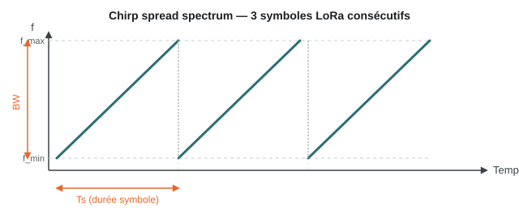

# LoRa & LoRaWAN

## Qu'est-ce que LoRa ?

**LoRa** (*Long Range*) est une technique de modulation de la couche physique radio, développée et brevetée par Semtech. Elle repose sur l'étalement de spectre par chirp (**CSS — Chirp Spread Spectrum**) : chaque symbole est encodé sous la forme d'un « chirp », un signal dont la fréquence balaie linéairement toute la largeur de bande disponible pendant une durée fixe, avant de revenir instantanément à sa fréquence de départ.

<figure markdown="span">
  
  <figcaption>Chaque symbole LoRa est un chirp : la fréquence monte linéairement sur toute la bande passante (BW) pendant la durée d'un symbole (Ts), puis repart de f_min.</figcaption>
</figure>

Cet étalement rend le signal très résistant au bruit et aux interférences : un récepteur LoRa peut démoduler un signal dont la puissance est **inférieure au niveau de bruit ambiant**, ce qui explique en grande partie sa portée exceptionnelle pour une consommation minime.

## Paramètres de la modulation

| Paramètre | Rôle | Valeurs typiques |
|---|---|---|
| **Spreading Factor (SF)** | Nombre de « chirps » utilisés par bit — plus il est élevé, plus la portée augmente mais plus le débit diminue | SF7 à SF12 |
| **Bandwidth (BW)** | Largeur de bande occupée par le signal | 125 / 250 / 500 kHz |
| **Coding Rate (CR)** | Redondance ajoutée pour la correction d'erreur (FEC) | 4/5 à 4/8 |

Le choix de ces trois paramètres définit un compromis **portée ↔ débit ↔ temps sur l'air**, ajustable au cas par cas (souvent automatiquement via l'*Adaptive Data Rate*, ADR).

## Fréquences utilisées

LoRa fonctionne dans les bandes **ISM sans licence**, dont l'attribution dépend de la région :

- **EU868** — 863–870 MHz (Europe, dont le Bénin et l'espace UEMOA s'alignent généralement sur les recommandations régionales proches de cette bande)
- **US915** — 902–928 MHz (Amérique du Nord)
- **AS923** — 915–928 MHz (Asie)

## Débit et portée

- **Débit** : de **0,3 kbps** (SF12, BW 125 kHz — portée maximale) à **50 kbps** (SF7, BW 500 kHz — portée réduite).
- **Portée** : jusqu'à **~15 km** en zone dégagée (rase campagne), de quelques centaines de mètres à quelques kilomètres en zone urbaine dense selon les obstacles.
- **Consommation** : très faible — un capteur alimenté par pile peut tenir plusieurs années.

## LoRaWAN : le protocole réseau

**LoRaWAN** est le protocole de réseau construit au-dessus de la couche physique LoRa. Il définit comment les objets connectés (*end-devices*) communiquent avec l'infrastructure :

<figure markdown="span">
  
  <figcaption>Réseau maillé du projet : les relais assurent la liaison BLE avec les smartphones et se maillent en LoRa jusqu'à la passerelle frontière et au network server.</figcaption>
</figure>

- **End-devices** : les capteurs/objets, qui émettent en LoRa vers toute passerelle à portée (pas d'association préalable à une passerelle en particulier).
- **Passerelle (Gateway)** : reçoit les trames LoRa et les relaie en IP (Ethernet, Wi-Fi ou 4G) vers le network server, sans les interpréter.
- **Network Server** : dé-duplique les messages reçus par plusieurs passerelles, gère la sécurité et route vers l'application server.
- **Application Server** : exploite les données métier.

### Classes d'appareils

| Classe | Comportement | Cas d'usage |
|---|---|---|
| **A** | La plus économe : le device n'écoute que juste après une émission | Capteurs, relevés périodiques |
| **B** | Fenêtres de réception programmées en plus de la classe A | Actionneurs nécessitant un contrôle plus réactif |
| **C** | Réception quasi continue | Appareils alimentés en continu, contrôle temps réel |

### Sécurité

LoRaWAN chiffre les échanges en **AES-128** à deux niveaux : la clé réseau (intégrité entre le device et le network server) et la clé applicative (confidentialité de bout en bout jusqu'à l'application server).

## Rôle dans ce projet

Dans l'architecture **Solution 1** de ce projet, LoRaWAN est combiné au BLE : un relais reçoit les données via BLE depuis le smartphone puis les fait transiter sur le réseau maillé LoRaWAN, pour la télémétrie, la messagerie légère et le paiement à faible volume. Voir la [comparaison complète](index.md).
