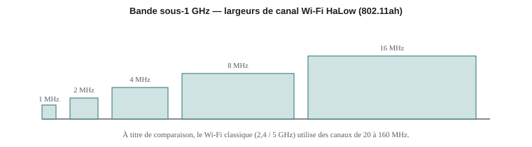
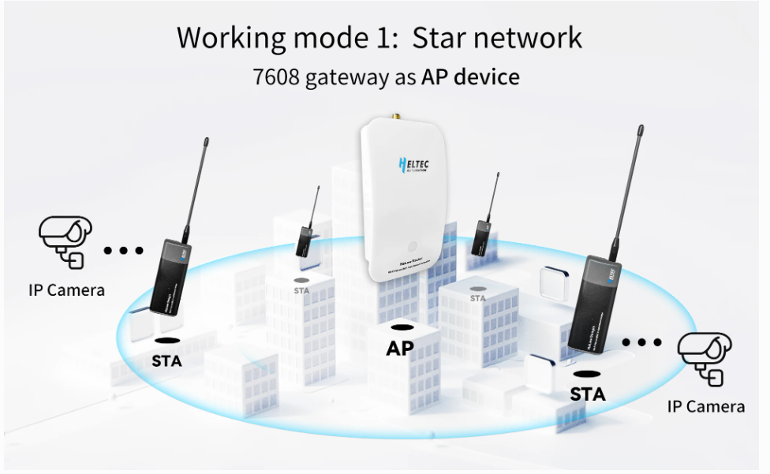
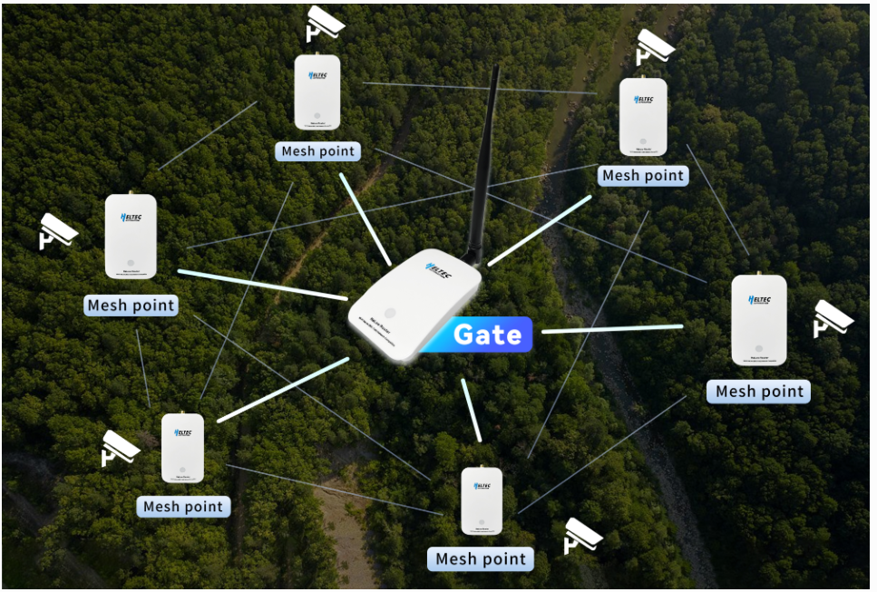

# Wi-Fi HaLow

## Qu'est-ce que le Wi-Fi HaLow ?

**Wi-Fi HaLow** est le nom commercial de la norme **IEEE 802.11ah**, une extension du Wi-Fi conçue pour fonctionner dans les bandes de fréquence **sous 1 GHz**. L'objectif : garder l'esprit du Wi-Fi (IP natif, débit exploitable) tout en gagnant fortement en portée et en consommation grâce à des fréquences plus basses, qui traversent mieux les obstacles que le 2,4 ou 5 GHz classiques.

## Modulation et bande de fréquence

Le Wi-Fi HaLow module en **OFDM** (*Orthogonal Frequency-Division Multiplexing*), une adaptation de celle utilisée en 802.11ac mais sur des canaux beaucoup plus étroits.

Les bandes exactes dépendent de la réglementation locale : **863–868 MHz** en Europe, **902–928 MHz** aux États-Unis, etc.

<figure markdown="span">
  
  <figcaption>Les canaux Wi-Fi HaLow (1 à 16 MHz) sont bien plus étroits que ceux du Wi-Fi classique (20 à 160 MHz) — c'est ce qui permet la portée étendue.</figcaption>
</figure>

## Débit et portée

- **Débit** : d'environ **150 kbps** (canal de 1 MHz) à environ **86 Mbps** (canal de 16 MHz, modulation maximale) — dans le contexte de ce projet, le débit visé pour la voix et la messagerie se situe autour de **8 Mbps**.
- **Portée** : environ **1 à 2 km** en extérieur dégagé, très supérieure au Wi-Fi classique.
- **Consommation** : plus élevée que LoRaWAN, mais optimisée par le mécanisme **TWT** (*Target Wake Time*), qui permet à un objet de négocier des créneaux de réveil précis et d'économiser l'énergie entre deux échanges.

## Topologie réseau

Le Wi-Fi HaLow peut se déployer selon deux modes de fonctionnement, selon la taille et la forme de la zone à couvrir.

### Mode réseau simple (étoile) — AP / STA

<figure markdown="span">
  
  <figcaption>Mode réseau simple (étoile) : une passerelle unique fait office de point d'accès (AP) et relie directement chaque station (STA) à portée.</figcaption>
</figure>

Dans ce mode, une seule passerelle joue le rôle de point d'accès (**AP**) et chaque appareil du réseau (une caméra IP, un capteur, un dongle) s'y connecte directement en tant que station (**STA**). C'est la topologie la plus simple : elle convient dès lors qu'une seule passerelle suffit à couvrir la zone, avec une portée pouvant atteindre 1 à 2 km en extérieur dégagé.

### Mode maillé (mesh) — Gate / Mesh Point

<figure markdown="span">
  
  <figcaption>Mode maillé : une passerelle centrale (Gate) relie plusieurs points de maillage (Mesh Point), chacun desservant localement les appareils à sa portée — utile pour couvrir un terrain étendu ou difficile d'accès.</figcaption>
</figure>

Quand une seule passerelle ne suffit pas à couvrir la zone (relief, distance, obstacles), plusieurs nœuds **Mesh Point** se répartissent autour d'une passerelle centrale (**Gate**) et relaient le trafic les uns vers les autres, chacun desservant localement les appareils qui lui sont proches. C'est ce mode maillé qui est repris dans l'architecture du projet : les nœuds HaLow se maillent entre eux jusqu'au cœur de réseau, tout comme les relais de la Solution 1 le font en LoRa.

Contrairement à LoRaWAN, qui nécessite un network server pour interpréter les trames, le Wi-Fi HaLow fonctionne **nativement en IP** : chaque station peut dialoguer directement avec le cœur de réseau, ce qui simplifie l'intégration de services comme la voix ou la messagerie enrichie. Un point d'accès peut prendre en charge jusqu'à **8191 stations**, ce qui le rend adapté aux déploiements denses de type IoT.

## Rôle dans ce projet

Le smartphone n'intègre pas nativement le Wi-Fi HaLow : un **dongle** fait la passerelle entre le smartphone (Wi-Fi classique ou BLE) et le réseau HaLow. C'est cette technologie qui apporte, dans l'architecture combinée, le débit nécessaire à la voix, à la messagerie enrichie et à l'accès Internet — là où LoRaWAN reste cantonné à l'IoT et à la télémétrie. Voir la [comparaison complète](index.md).
